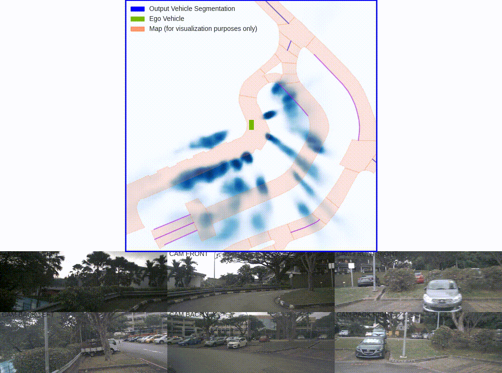
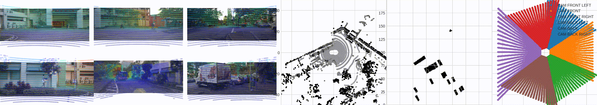

# Lift, Splat, Shoot: Encoding Images From Arbitrary Camera Rigs by Implicitly Unprojecting to 3D

PyTorch code for Lift-Splat-Shoot (ECCV 2020).

**Lift, Splat, Shoot: Encoding Images From Arbitrary Camera Rigs by Implicitly Unprojecting to 3D**  
Jonah Philion, [Sanja Fidler](http://www.cs.toronto.edu/~fidler/)\
ECCV, 2020 (Poster)\
**[[Paper](https://arxiv.org/abs/2008.05711)] [[Project Page](https://nv-tlabs.github.io/lift-splat-shoot/)] [[10-min video](https://youtu.be/oL5ISk6BnDE)] [[1-min video](https://youtu.be/ypQQUG4nFJY)]**

**Abstract:**
The goal of perception for autonomous vehicles is to extract semantic representations from multiple sensors and fuse these representations into a single "bird's-eye-view" coordinate frame for consumption by motion planning. We propose a new end-to-end architecture that directly extracts a bird's-eye-view representation of a scene given image data from an arbitrary number of cameras. The core idea behind our approach is to "lift" each image individually into a frustum of features for each camera, then "splat" all frustums into a rasterized bird's-eye-view grid. By training on the entire camera rig, we provide evidence that our model is able to learn not only how to represent images but how to fuse predictions from all cameras into a single cohesive representation of the scene while being robust to calibration error. On standard bird's-eye-view tasks such as object segmentation and map segmentation, our model outperforms all baselines and prior work. In pursuit of the goal of learning dense representations for motion planning, we show that the representations inferred by our model enable interpretable end-to-end motion planning by "shooting" template trajectories into a bird's-eye-view cost map output by our network. We benchmark our approach against models that use oracle depth from lidar. Project page: [https://nv-tlabs.github.io/lift-splat-shoot/](https://nv-tlabs.github.io/lift-splat-shoot/).

**Questions/Requests:** Please file an [issue](https://github.com/nv-tlabs/lift-splat-shoot/issues) if you have any questions or requests about the code or the [paper](https://arxiv.org/abs/2008.05711). If you prefer your question to be private, you can alternatively email me at jphilion@nvidia.com.

### Citation
If you found this codebase useful in your research, please consider citing
```
@inproceedings{philion2020lift,
    title={Lift, Splat, Shoot: Encoding Images From Arbitrary Camera Rigs by Implicitly Unprojecting to 3D},
    author={Jonah Philion and Sanja Fidler},
    booktitle={Proceedings of the European Conference on Computer Vision},
    year={2020},
}
```

### Preparation
Download nuscenes data from [https://www.nuscenes.org/](https://www.nuscenes.org/). Install dependencies.

```
pip install nuscenes-devkit tensorboardY efficientnet_pytorch
```

### Pre-trained Model
Download a pre-trained BEV vehicle segmentation model from here: [https://drive.google.com/file/d/18fy-6beTFTZx5SrYLs9Xk7cY-fGSm7kw/view?usp=sharing](https://drive.google.com/file/d/18fy-6beTFTZx5SrYLs9Xk7cY-fGSm7kw/view?usp=sharing)

| Vehicle IOU (reported in paper)        | Vehicle IOU (this repository)         |
|:-------------:|:-------------:| 
| 32.07      | 33.03 |

### Evaluate a model
Evaluate the IOU of a model on the nuScenes validation set. To evaluate on the "mini" split, pass `mini`. To evaluate on the "trainval" split, pass `trainval`.

```
python main.py eval_model_iou mini/trainval --modelf=MODEL_LOCATION --dataroot=NUSCENES_ROOT
```

### Visualize Predictions
Visualize the BEV segmentation output by a model:

```
python main.py viz_model_preds mini/trainval --modelf=MODEL_LOCATION --dataroot=NUSCENES_ROOT --map_folder=NUSCENES_MAP_ROOT
```


### Visualize Input/Output Data (optional)
Run a visual check to make sure extrinsics/intrinsics are being parsed correctly. Left: input images with LiDAR scans projected using the extrinsics and intrinsics. Middle: the LiDAR scan that is projected. Right: X-Y projection of the point cloud generated by the lift-splat model. Pass `--viz_train=True` to view data augmentation.

```
python main.py lidar_check mini/trainval --dataroot=NUSCENES_ROOT --viz_train=False
```


### Train a model (optional)
Train a model. Monitor with tensorboard.

```
python main.py train mini/trainval --dataroot=NUSCENES_ROOT --logdir=./runs --gpuid=0
tensorboard --logdir=./runs --bind_all
```

### Acknowledgements
Thank you to Sanja Fidler, as well as David Acuna, Daiqing Li, Amlan Kar, Jun Gao, Kevin, Xie, Karan Sapra, the NVIDIA AV Team, and NVIDIA Research for their help in making this research possible.
